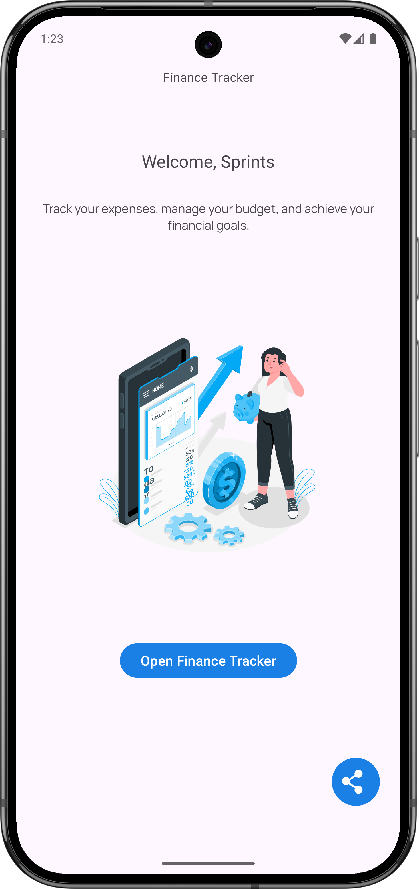
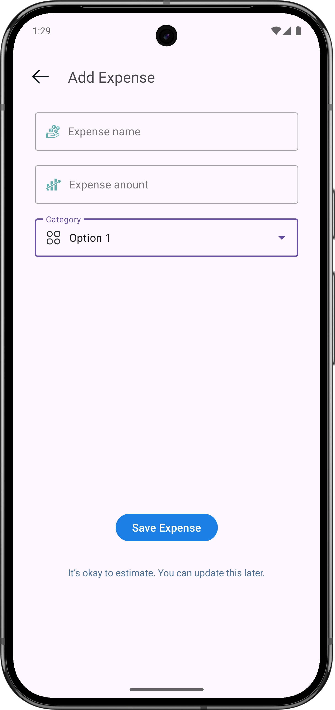
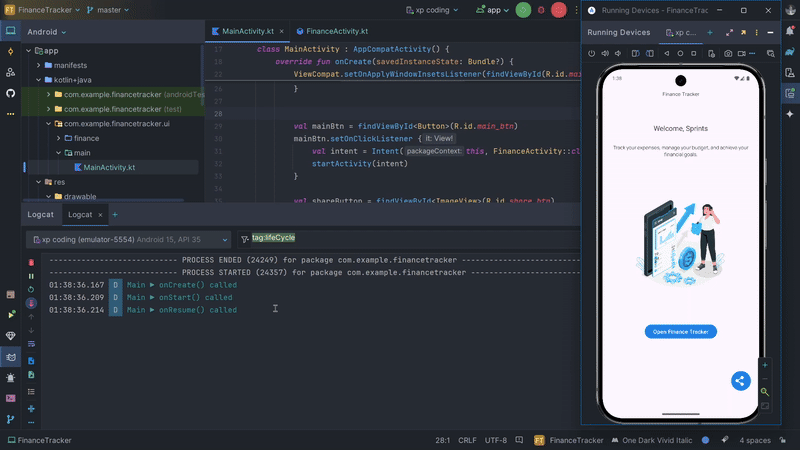

# Finance Tracker Android App


A modern, two-screen Android application built to demonstrate core Android development concepts, including activity lifecycle logging, explicit and implicit intents, and clean resource organization. The app features a **Welcome Screen** and a **Finance Tracker Screen**, crafted with XML layouts and styled with Material Design principles.

---

## Features

- **Welcome Screen (`MainActivity`)**
  - Displays a friendly welcome message.
  - **Track Expense** button navigates to the Finance Tracker screen via an explicit intent.
  - **Share** button sends a sample expense summary (e.g., "I just added a new expense: Lunch – $10") via an implicit intent.
- **Finance Tracker Screen (`FinanceActivity`)**
  - Form to input expense details: name, amount, and category (via a Material Design dropdown).
  - **Save Expense** button (UI-only, no backend).
  - Styled with MaterialTheme-compatible colors, dimensions, and vector icons.
- **Activity Lifecycle Logging**
  - Logs `onCreate`, `onStart`, `onResume`, `onPause`, `onStop`, and `onDestroy` for both activities using `Log.d`.
- **Resource Management**
  - Externalized strings (`strings.xml`), colors (`colors.xml`), dimensions (`dimens.xml`), and vector assets (`drawable/`).
- **UI Design**
  - Uses `ConstraintLayout` as the root layout, with nested `LinearLayout` or `FrameLayout` for logical grouping.
  - Applies ≥5 XML attributes per screen for styling (e.g., `textSize`, `layout_margin`, `padding`, `gravity`, `textColor`).

---

## Screenshots

| Welcome Screen | Finance Tracker Screen |
|----------------|------------------------|
|  |  |


---

## Technical Details

### Activity Lifecycle Table

The app logs the Android activity lifecycle methods for both `MainActivity` and `FinanceActivity`. Below is a summary of each lifecycle method and its role:

| Lifecycle Method | Description | State Transition |
|------------------|-------------|------------------|
| `onCreate()`     | Called when the activity is created and loaded into memory. Initializes the app's components and prepares it to exist in the **background**. | Created (Background) |
| `onStart()`      | Brings the activity from **background** to the **foreground**, making it visible but not yet interactive. | Visible (Foreground, Non-Interactive) |
| `onResume()`     | Enables interaction in the app (e.g., buttons) in the **foreground**. The activity is now fully active. | Interactive (Foreground) |
| `onPause()`      | Disables interaction in the app while it remains partially visible in the **foreground** (e.g., obscured by a dialog). | Partially Visible (Foreground, Non-Interactive) |
| `onStop()`       | Returns the activity from **foreground** to **background**, making it invisible. | Invisible (Background) |
| `onDestroy()`    | Removes the activity from memory, cleaning up resources in the **background**. | Destroyed (Removed from Memory) |

*Lifecycle logs can be viewed in Logcat with the tag `MainActivity` or `FinanceActivity`.*

### Tech Stack

- **Language**: Kotlin
- **UI**: XML Layouts (no Jetpack Compose)
- **Layouts**: `ConstraintLayout` (root), `LinearLayout`/`FrameLayout` (nested)
- **Navigation**: Explicit Intents (`MainActivity` → `FinanceActivity`), Implicit Intents (Share action)
- **Libraries**:
  - AndroidX Core
  - Material Components (`com.google.android.material:material:1.12.0`)
- **Resources**:
  - `strings.xml`: All text strings
  - `colors.xml`: App color palette
  - `dimens.xml`: Margins, paddings, text sizes
  - `drawable/`: Vector icons for buttons and fields
- **Tools**: Android Studio, Logcat for lifecycle debugging

---

## Getting Started

### Prerequisites

- **Android Studio**: Latest stable version (e.g., Koala | 2024.1.1 or later)
- **JDK**: 17 or higher
- **Android SDK**: API Level 21 (Lollipop) or higher
- **Emulator or Physical Device**: Running Android 5.0+

### Installation

1. **Clone the Repository**:
   ```bash
   git clone https://github.com/your-username/finance-tracker-android.git
   cd finance-tracker-android
   ```

2. **Open in Android Studio**:
   - Launch Android Studio.
   - Select `Open` and navigate to the cloned project directory.
   - Let Gradle sync the project dependencies.

3. **Run the App**:
   - Connect an emulator or physical device.
   - Click `Run` (Shift+F10) to build and install the APK.
   - Observe lifecycle logs in Logcat (filter by tags `MainActivity` or `FinanceActivity`).

4. **Explore Features**:
   - On the Welcome Screen, tap **Track Expense** to navigate to the Finance Tracker.
   - Tap **Share** to send a sample expense summary via an implicit intent.
   - On the Finance Tracker Screen, fill out the expense form and tap **Save Expense** (UI-only).

---

## Project Structure

```
finance-tracker-android/
├── app/
│   ├── src/
│   │   ├── main/
│   │   │   ├── java/com/example/financetracker/
│   │   │   │   ├── MainActivity.kt          # Welcome Screen logic
│   │   │   │   ├── FinanceActivity.kt       # Finance Tracker Screen logic
│   │   │   ├── res/
│   │   │   │   ├── drawable/                # Vector icons
│   │   │   │   ├── layout/
│   │   │   │   │   ├── activity_main.xml    # Welcome Screen layout
│   │   │   │   │   ├── activity_finance.xml # Finance Tracker layout
│   │   │   │   ├── values/
│   │   │   │   │   ├── strings.xml          # App strings
│   │   │   │   │   ├── colors.xml           # Color palette
│   │   │   │   │   ├── dimens.xml           # Dimensions
│   │   │   │   │   ├── arrays.xml           # Dropdown categories
├── README.md                                # Project documentation
├── build.gradle                             # App-level Gradle config
├── settings.gradle                          # Project settings
```

---

## Demo Video



---

## Customization

To extend the app, consider these enhancements:
- **Backend Integration**: Save expenses to a local database (Room) or cloud service (Firebase).
- **RecyclerView**: Display a list of saved expenses on a new screen.
- **Input Validation**: Add checks for expense name and amount fields.
- **Theming**: Customize `themes.xml` for light/dark mode support.
- **Unit Tests**: Write tests for activity navigation and lifecycle methods.

---

## Contributing

Contributions are welcome! To contribute:
1. Fork the repository.
2. Create a feature branch (`git checkout -b feature/your-feature`).
3. Commit your changes (`git commit -m "Add your feature"`).
4. Push to the branch (`git push origin feature/your-feature`).
5. Open a Pull Request.

Please follow the [Code of Conduct](CODE_OF_CONDUCT.md) and report issues via the [Issues](https://github.com/your-username/finance-tracker-android/issues) tab.

---

## License

This project is licensed under the MIT License. See [LICENSE](LICENSE) for details.
